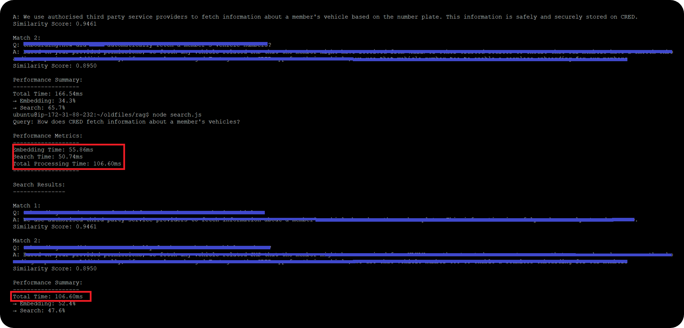

# Realtime Knowledge Base for Voice AI Agents (RAG)

<div align="center">
  

  <div align="center">
    <h2>⚡ Performance Metrics</h2>
    <table>
      <tr>
        <td align="center">
          <strong>Average Latency</strong><br>
          <code>100ms - 120ms</code>
        </td>
      </tr>
    </table>
    <p><em>* Measured on Dedicated M50 Cluster with optimized resources (Models, DB, VM)</em></p>
    <p><sub>Assumptions: Network latency < 20ms, Concurrent users < 1000, Document size < 2MB</sub></p>
  </div>
</div>

## 🎯 Overview

This project implements a high-performance vector search system for FAQ retrieval, optimized for voice AI agents. It uses Azure OpenAI's embeddings and MongoDB's vector search capabilities to provide fast and accurate semantic search results.

## ✨ Features

- **⚡ Real-time Semantic Search**: Utilizes Azure OpenAI's text-embedding-3-small model
- **🔍 Vector Similarity Search**: Powered by MongoDB's vector search capabilities
- **⚙️ Performance Optimized**: Connection pooling and resource management
- **📊 Detailed Performance Metrics**: Real-time monitoring of embedding and search times

## 🛠️ Technical Stack

| Component | Technology |
|-----------|------------|
| **Embedding Model** | Azure OpenAI text-embedding-3-small |
| **Database** | MongoDB with Vector Search |
| **Backend** | Node.js |
| **Vector Dimensions** | 1536 |
| **Similarity Metric** | Dot Product |

## 🚀 Setup Instructions

1. **Environment Setup**
   ```bash
   # Clone the repository
   git clone <repository-url>
   
   # Install dependencies
   npm install
   ```

2. **Environment Variables**
   ```env
   AZURE_ENDPOINT_URL=<your-azure-endpoint>
   AZURE_API_KEY=<your-azure-api-key>
   MONGODB_URI=<your-mongodb-uri>
   ```

3. **Generate Embeddings**
   ```bash
   # Generate and store embeddings
   python generate_embedding.py
   ```

4. **Run Search**
   ```bash
   # Start the search application
   node search.js
   ```

## 📊 Performance Metrics

The system provides detailed performance metrics for:
- ⏱️ Embedding Generation Time
- 🔍 Search Operation Time
- ⚡ Total Processing Time
- 📈 Performance Distribution Analysis

## 🗄️ MongoDB Vector Index Configuration

```json
{
  "fields": [
    {
      "type": "vector",
      "path": "embedding",
      "numDimensions": 1536,
      "similarity": "dotProduct"
    }
  ]
}
```

## ⚙️ Optimization Features

- 🔄 Connection pooling for MongoDB
- 🌐 HTTPS agent optimization
- ⚡ Axios instance pre-configuration
- 🧹 Resource cleanup and management
- 🛡️ Error handling and logging

## 💻 Usage Example

```javascript
const queryText = "Enter your query here...";
const results = await searchFAQs(queryText);
```

## ⚡ Performance Considerations

| Parameter | Value |
|-----------|--------|
| Minimum Pool Size | 5 connections |
| Maximum Pool Size | 10 connections |
| Connection Timeout | 5000ms |
| Idle Timeout | 60000ms |

## 📄 License

MIT License

## 📬 Contact

* Website: [quansys.ai](https://shivsingh.com)
* Email: hi@shivsingh.com
* LinkedIn: [QuansysAI](https://linkedin.com/in/shivsinghin)
